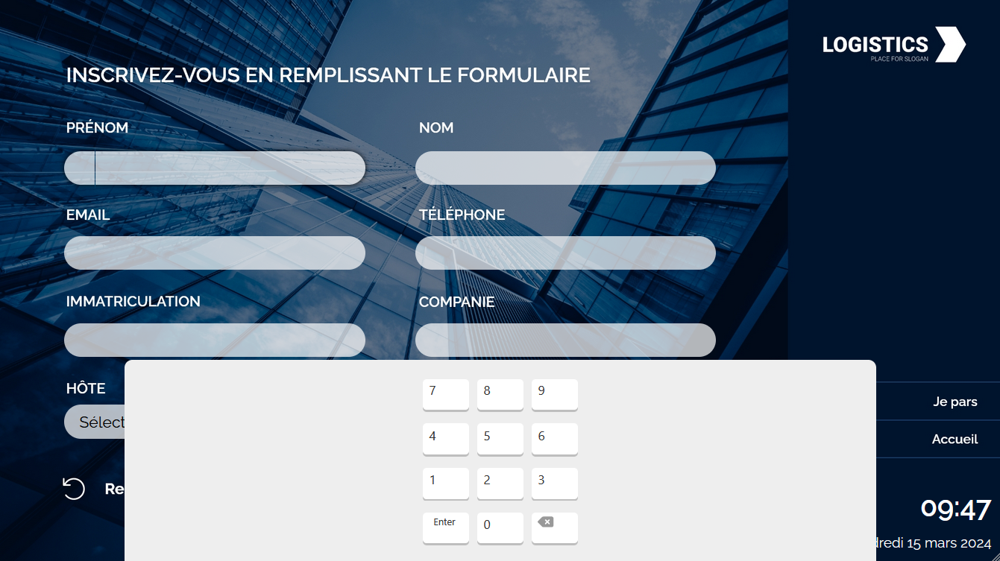
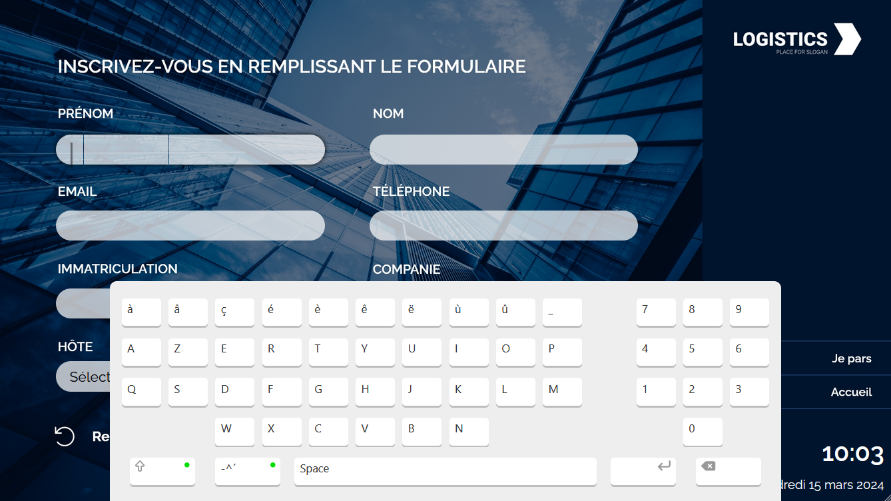
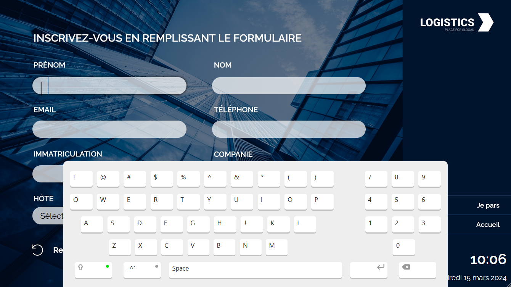

# Keyboard configuration

## Description

This is a detailed documentation about own to configure a keyboard in your route config json file.

If you don't know what a route is, start by reading the `jsonFormat.md` documentation. We recommend you have a good understanding of how a route works before going forward with this documentation.

## Table of content

- [Description](#description)
- [Table of content](#table-of-content)
- [Usage](#usage)
- [Features](#features)
- [Configuration breakdown](#configuration-breakdown)
	- [Layout](#layout)
	- [Mode](#mode)
	- [Slide animation](#slide-animation)
	- [Custom layout](#custom-layout)
	- [Actions override](#actions-override)
	- [Style override](#style-override)
- [Examples](#examples)

## Usage

You don't have to configure a keyboard in all of your routes. A keyboard will only toggle on pages containing at least one `text` input.

If you do have `text` inputs, your keyboard config must be defined on the flow level of your route.

```json
{
	"name": "My awesome route",
	"languages": [],
	"scheduling": {},
	"flows": [
		{
			"name": "My awesome flow",
			"id": "uuid",
			"pages": [],
			//...
			"keyboard": {}
		}
	]
}
```
Your keyboard can then be customized for each flow. It cannot be customized for each page, so if you have multiple pages containing `text` inputs, make sure your keyboard looks nice on each one.

## Features

Keyboards inside the `Engine` have cool features that simulates the behavior of an actual keyboard as closely as possible, so you don't have to worry about configuring every aspect of the keyboard usage.

### Keyboard toggle

By default, a keyboard is hidden and will toggle when focusing or unfocusing from a `text` input. If you want your keyboard to be visible when landing on the page, you can specify an `autoFocus` property on the appropriate `text` input.

For now, you can't lock the keyboard display. Clicking outside of the keyboard or the `text` input will unfocus them and hide the keyboard. This feature could be configured in the future if there's a need for it.

### Auto shift

By default, the keyboard will always start in a shift state. So the end user can start typing and not worry about capitalization. The shift will automatically toggle to lower case after the first lettre is typed, then go back to capitalization right after a `-` character.

You can lock this feature and force the keyboard into lower or upper case if needed by defining a `forceLowerCase` or `forceUpperCase` property on the appropriate `text` input. Note that the end user can still toggle in upper or lower case by simply pressing the shift key.

### Shift lock

By double clicking on the shift key, you will lock your keyboard in upper case. Clicking it once will unlock it.

### Hold delete

By holding the backspace (delete) key, you will be able to delete multiple letters in a row. The speed of the delete is exponential, holding it longer will accelerate the deletion.

### Pressed key animation

For optimal end user feedback, a key will subtely move down on click/touch down and go back to its original position on click/touch up.

### Caret

In a focused `text` input, a blinking caret will help the end user know where they are typing.

## Configuration breakdown

Here is a what a full configuration looks like:

```json
{
	// The rest of your route goes here

	"keyboard": {
		"layout": "classic|compact|numpad|full|custom",

		"mode": "azerty|qwerty",

		"slideAnimation": "top|right|left|bottom|top_left|top_right|bottom_left|bottom_right",

		"customLayout": {
			"rows": [
				{
					"keys": [
						{
							"text": {
								"defaultValue": "a",
								"capslockValue": "A",
								"specCharsValue": "!"
							},
							"action": "shift",
							"style": {}
						}
					],
					"style": {}
				}
			]
		},

		"actionsOverride": {
			"0": {
				"0": [
					{
						"type": "nextpage|saveservice|changelanguage|...",
						"navigateTo": "UUID",
						"service": {
							"serviceId": 1,
							"devServiceId": 2,
							"priority": 0
						},
						"language": "fr|en|es|nl"
					}
				]
			}
		},

		"styleOverride": {
			"board": {},

			"rows": [
				{
					"index": 0,
					"style": {},
					"keys": [
						{
							"index": "all",
							"style": {},
							"valueOverride": "X"
						}
					]
				}
			],

			"statusDot": {
				"disabled": {},
				"enabled": {},
				"secondaryEnabled": {}
			}
		}
	}
}
```
It can seem daunting, but this complex config allows you to have full control over the customization of your keyboard.

Also, you don't *have to* use all of this config every time you need a keyboard. If you don't need any specific adjustment, you can just pick a default layout and stick with it. Then your config looks like this:

```json
{
	// The rest of your route goes here

	"keyboard": {
		"layout": "classic",
	}
}
```
No as threatening now does it?

Now, let's breakdown what all of this config is used for.

### Layout

The layout is the only required property when defining your keyboard. Multiple layouts are provided so you have a sturdy base.

The possible options for the `layout` property are:

- `classic`:
	- First row is composed of numbers and special characters.
	- The three following rows are letters.
	- The last row are actions: shift, special chars toggle, spacebar, enter and backspace.


***Note: the enter key will toggle your keyboard out of the screen.***

- `compact`: Follows the same pattern as the classic layout but letters occupy only two rows. Usefull if you need your keyboard to take as little space as possible but keep in mind that this layout is not natural for end users, who will probably have a difficult time getting used to it.


- `numpad`: classic numpad as laid out on a regular keyboard.
	- Three rows of numbers.
	- Last row has enter, 0 and backspace keys.



- `full`: This is as close as you'll get of a regular keyboard. Follows the same patterns as a `classic` and a `numpad` layout separated in two zones.
	- Left zone:
		- First row doesn't have the numbers and switches between special characters.
		- Three rows of letters.
		- Last row has the same actions as the `classic` layout.
	- Right zone:
		- The `numpad`, minus the enter and backspace keys.s


- `custom`: Define a `custom` layout if you want to build your own keyboard. Provide it with the `customLayout` property of your config.

### Mode

The provided keyboards can either be azerty or qwerty.

By default, all layouts are in azerty. If you want a qwerty keyboard, that's where you need to specify it.

```json
{
	// The rest of your route goes here

	"keyboard": {
		"layout": "full",
		"mode": "qwerty"
	}
}
```

Note that, in addition to letters being rearranged, the special characters will differ between modes.

Here are the special chars options on a full azerty keyboard:




And here they are on a full qwerty keyboard:




#### Why the accentuated letters?

Please note that the azerty layout is based on a **Belgian French** keyboard layout.

If you need a French from France layout or want to replace the accentuated chars by something else, you will have to configure the keys to replace their value. More on that in the [`styleOverride`](#style-override) section.

### Slide animation

By default, the keyboard will slide in and out of the screen from the bottom center.

If you modify your keyboard position, the animation will automatically adjust to naturally slide in and out from the edges of the screen.

For example: If you position the keyboard on the top with a `top: 0;` CSS property, the keyboard will automatically slide from the center top of the screen.

Note that this automation only work for position values defined at `0`.

You can however override this automation by adding a `slideAnimation` property to your config.

```json
{
	"keyboard": {
		"layout": "classic",
		"slideAnimation": "top"
	}
}
```

Here are the possible options:

- `bottom`: **Default behavior**. The keyboard will slide in and out from the bottom center of the screen.
- `top`: The keyboard will slide in and out from the top center of the screen.
- `left`: The keyboard will slide in and out from the center left of the screen.
- `right`: The keyboard will slide in and out from the center right of the screen.
- `top_left`: The keyboard will slide in and out from the top left corner of the screen.
- `top_right`: The keyboard will slide in and out from the top right corner of the screen.
- `bottom_left`: The keyboard will slide in and out from the bottom left corner of the screen.
- `bottom_right`: The keyboard will slide in and out from the bottom right corner of the screen.

*Note: If you define a `top: 0;` **and** a `left: 0;` CSS properties, the automation will use the `top_left` animation and so on.*

### Custom layout

This is where you can construct your own keyboard from start to finish. Used with the `"layout": "custom"` property in your keyboard config. The provided layouts use the same mechanics.

If you need an example, check out the [Examples](#examples) section of this documentation.

```json
{
	"keyboard": {
		"layout": "custom",
		"customLayout": {
			"rows": [
				{
					"keys": [
						{
							"text": {
								"defaultValue": "a",
								"capslockValue": "A",
								"specCharsValue": "!"
							},
							"action": "shift|spacebar|enter|backspace|specialchars",
							"style": {
								"all": "css properties"
							}
						}
					],

					"style": {}
				}
			]
		}
	}
}
```

Here's how to construct your custom keyboard:

#### Rows

This is the main and only property at the root of your custom config. It is an array of rows objects. Each row defined here will generate a row in your keyboard.

A row is composed of:
- An array of `keys`.
- An optional `style` containing CSS properties. All rows have a default style to display the keys, that's where you can override those.

#### Keys

This is an array of the keys in your row. Each key is composed of:

- An optional `style` containing CSS properties. All keys have a default style, this is where you can override it. Note that this style will apply to *one* key at a time.
- An optional `action`. If your key is doing an action, this is where you define it. Default symbols and styling will be added to differenciate the actions. The available actions are:
	- `shift`: Toggle your keyboard in and out of shift mode.
	- `spacebar`: Add a spacebar to your keyboard.
	- `enter`: Add an enter key to your keyboard. Note that the enter key only hides your keyboard, it doesn't jump to a new line.
	- `backspace`: Add a backspace (delete) key to your keyboard.
	- `specialchars`: Toggle the special characters in your keyboard.
- Finally, an optional `text`. This is the letter/character that will be added to your input when clicked/touched. To construct it, you will need:
	- A required `defaultValue`: This is your value when shift and/or special characters are disabled.
	- An optional `capslockValue`: This is your value when shift is enabled.
	- An optional `specCharsValue`: This is your value when special characters are enabled.

	To construct a `text` key, you can pick `capslockValue` <ins>**or**</ins> `specCharsValue` in addition to your `defaultValue`, but not both.

### Actions override

When you use a provided `layout`, you can use `actionsOverride` if you want one or more keys to have a different behavior. We recommend you attach your action override to an action key rather than a text key.

```json
{
	"actionsOverride": {
		"_row index": {
			"_key index": [
				{
					"type": "nextpage|previouspage|homepage|printticket|saveservice|changelanguage|checkin|checkout...",
					"navigateTo": "UUID",
					"service": {
						"serviceId": 1,
						"devServiceId": 2,
						"priority": 0
					},
					"language": "fr|en|es|nl"
				}
			]
		}
	}
}
```

1. To override an action, you need to first target the row of the key by using a `0 to (rows number - 1)` index. The index starts at the top row of your keyboard and works its way down. Use it as a property key of your `actionsOverride`.

2. Then, you need to target the key you want to override. Use the same system as the row by targeting a `0 to (number of keys in the row - 1)` index. The index starts on the key to the far left of your row and works its way to the key on far right of the row. Use it as a property key.

3. There, you need to provide an array of `actions` as described in the main `jsonFormat.md`'s input actions. Here is a reminder of the available `actions`:

```json
"actions": [
	{
		"type": "nextpage",
		"navigateTo": "page UUID"
	},
	{
		"type": "previouspage"
	},
	{
		"type": "homepage"
	},
	{
		"type": "saveservice",
		"service": {
			"serviceId": 1,
			"devServiceId": 2,
			"priority": 1
		}
	},
	{
		"type": "createticket"
	},
	{
		"type": "printticket"
	},
	{
		"type": "changelanguage",
		"language": "fr|nl|en|es"
	},
	{
		"type": "checkin"
	},
	{
		"type": "checkout"
	},
	{
		"type": "checktextinputs"
	},
	{
		"type": "custom"
	}
]
```

If you need an example, check out the [Examples](#examples) section of this documentation.

### Style override

This is where you can fully customize the appearance of your keyboard.

```json
{
	"keyboard": {
		"layout": "classic",

		"styleOverride": {
			"board": {},

			"rows": [
				{
					"index": 0,
					"style": {},
					"keys": [
						{
							"index": "all",
							"style": {},
							"valueOverride": "X"
						}
					]
				}
			],

			"statusDot": {
				"disabled": {},
				"enabled": {},
				"secondaryEnabled": {}
			}
		}
	}
}
```

#### Board

This optional property is where you can customize the style of the board. You can change its background color, its position, width, height, anything.

Use the `board` property and add your own CSS properties that will override the default ones.

#### Rows

This optional `rows` property is an array of object that target the row you want to customize.

- `index`: Specify the targeted row's index. It can either be `"all"` to target all rows at once, or a `0 to (rows number - 1)` number following the same convention as in the `actionsOverride` property.
- `style`: Optional. Specify the CSS properties of your row to override the default ones.
- `keys`: Optional. This is where you can target the keys of a row and override its style.
	- `index`: Specify the targeted key's index of your row. It can either be `"all"` to target all keys of the row at once, or a `0 to (keys in the row number - 1)` number following the same convention as in the `actionsOverride` property.
	- `style`: Specify the CSS properties of your key to override the default ones.
	- `valueOverride`: Optional. Use this if you want to replace the default value of your key.
		- On `text` keys, this will replace the value of your key and pressing it will enter the new value. Note that shift and special characters don't apply here.
		- On `action` keys, this will replace the default symbol or text of the key.

#### Status dot

This optional `statusDot` property is where you can customize the status dot of a shift or special character key.

- `disabled`: This is the status dot when your shift/special chars key is disabled. Specify the CSS properties to override the default ones.
- `enabled`: This is the status dot when your shift/special chars key is enabled. Specify the CSS properties to override the default ones.
- `secondaryEnabled`: Optional. This is the status dot when you shiftlock your keyboard. Specify the CSS properties to override the default ones.

If you need an example, check out the [Examples](#examples) section of this documentation.

## Examples
